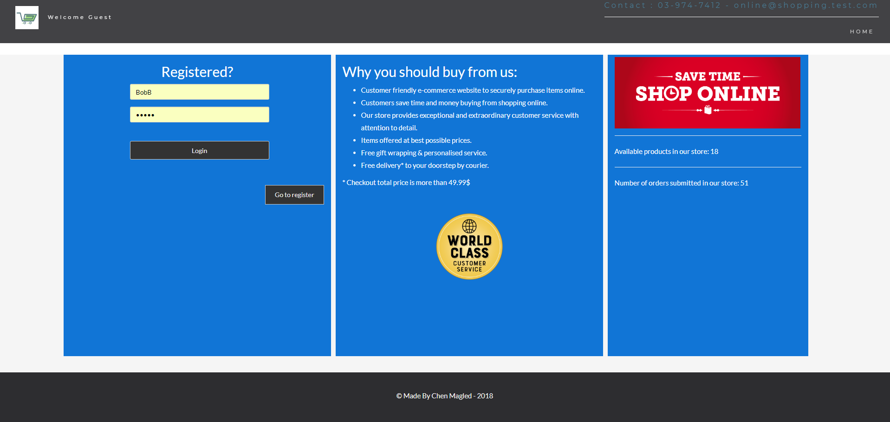
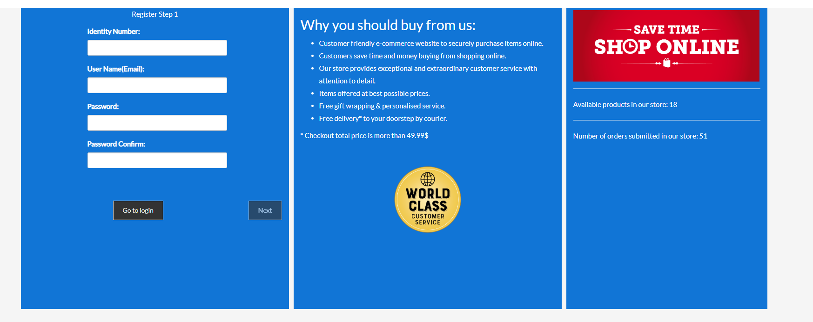
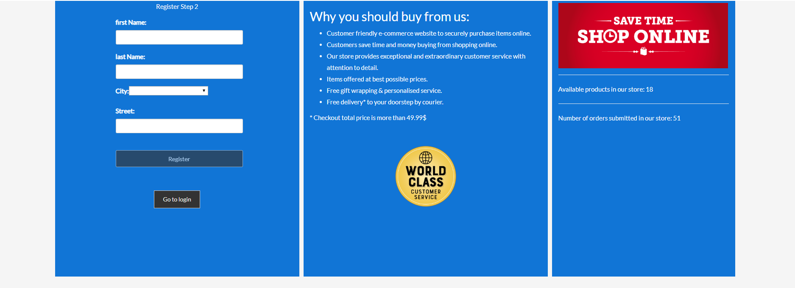
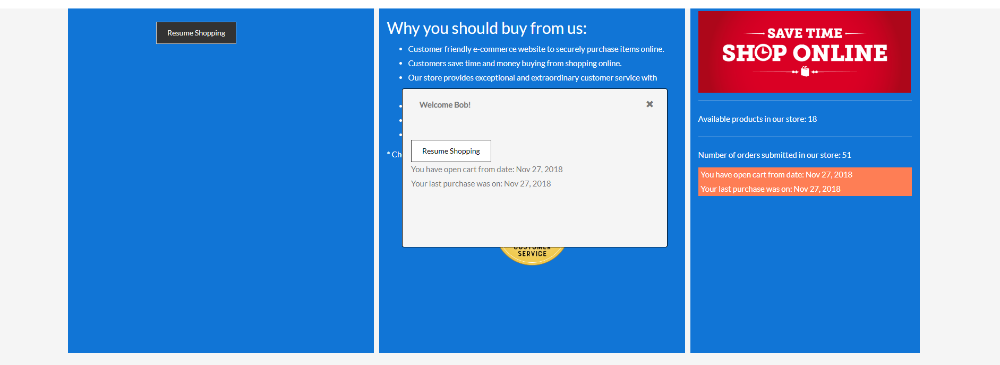
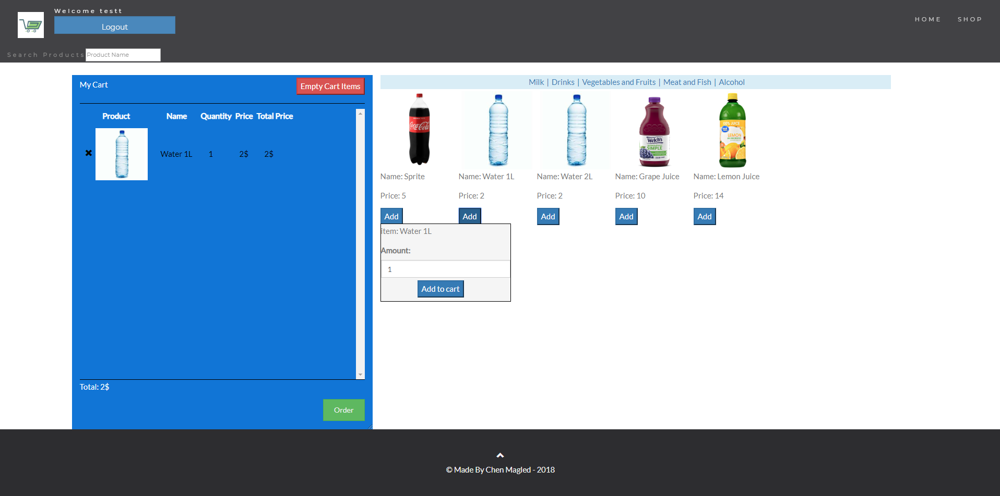
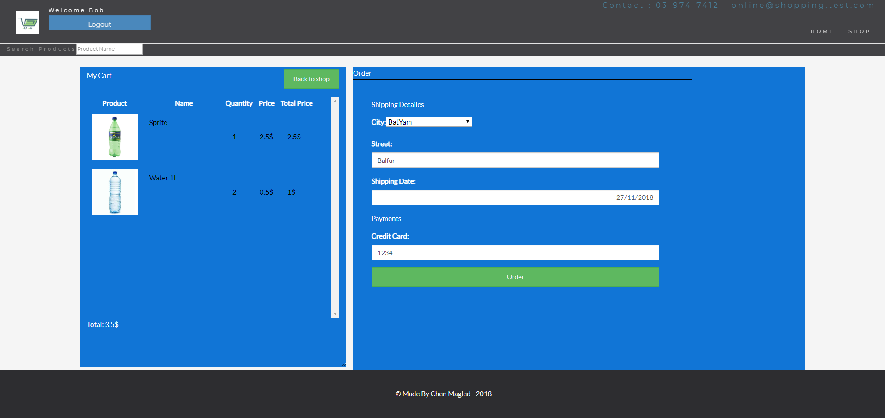
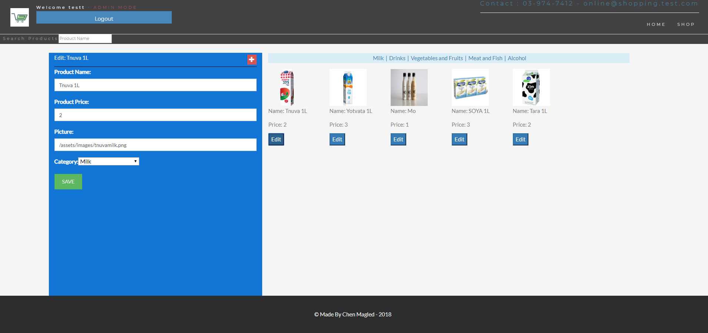

# The School
* A project that was developed with PHP language and MVC architecture pattern.

* Management system of students, courses and school staff.

## topics:

### HTML + CSS :
* HTML5 Structre
* Bootstrap Design

<<<<<<< HEAD
### NodeJS :

1. Mogoose(MongoDB)
2. Express(Server)
=======
### PHP :
* MVC Structre
* Routing
* Object Oriented
* Password encryption

### MySQL :
* Design & create schema
* Queries
>>>>>>> 34815ecedc606eade1a8bacf1717d3b76e1cffac

***

## Requirements:

<<<<<<< HEAD
1. NPM
2. NodeJS, Angular.

## How to run:

=======
1. PHP environment.
2. MySQL Database.

## How to run:

1. Copy the Application files to your host ("mvc" and "inc" should be one directory before public_html).
2. Configure the config.php file to suit your MySQL database connection.
3. Run the sql file on your database, so you will have all the tables needed.
4. Enter your website and than login to the owner account.
>>>>>>> 34815ecedc606eade1a8bacf1717d3b76e1cffac

***

<<<<<<< HEAD
### Home Page:

### Register Step One:

### Register Step Two:

### Customer Login Successful:

### Add Item To Cart / Products List:

### Order Page:

### Order Receipt:

### Admin Edit/Add products page:

=======
### Login:

### School Home:

### Admin Home:

### Student View:

### Student Edit:

### Course View:

### Course Edit:

### Admin Edit:

>>>>>>> 34815ecedc606eade1a8bacf1717d3b76e1cffac

