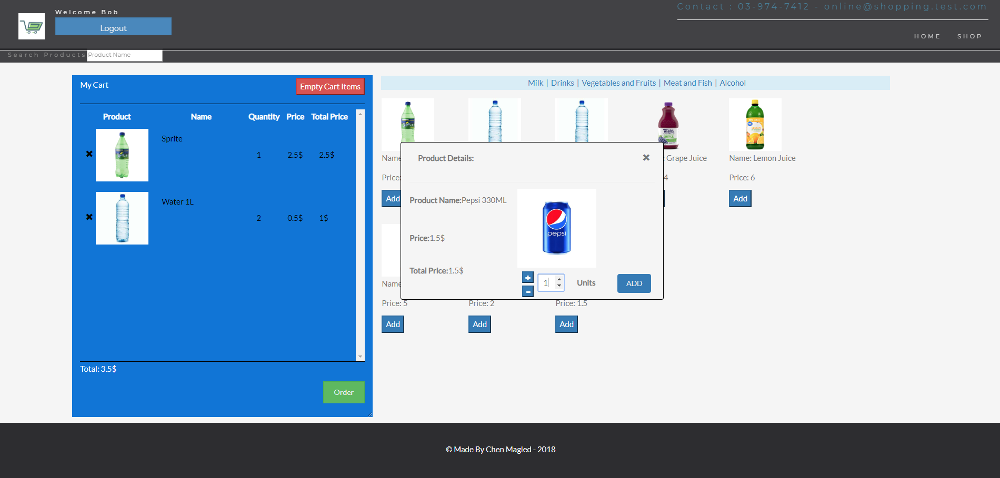

# The School
* A project that was developed with PHP language and MVC architecture pattern.

* Management system of students, courses and school staff.

## topics:

### HTML + CSS :
* HTML5 Structre
* Bootstrap Design

### NodeJS :

1. Mogoose(MongoDB)
2. Express(Server)

***

## Requirements:

1. NPM
2. NodeJS, Angular.

## How to run:

***

### Home Page:

### Register Step One:

### Register Step Two:

### Customer Login Successful:

### Add Item To Cart / Products List:

### Order Page:

### Order Receipt:

### Admin Edit/Add products page:

